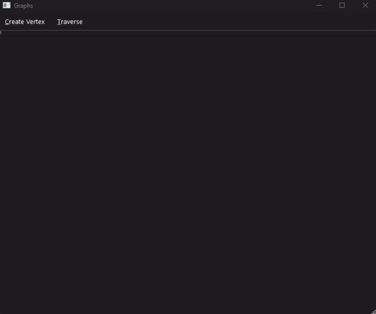
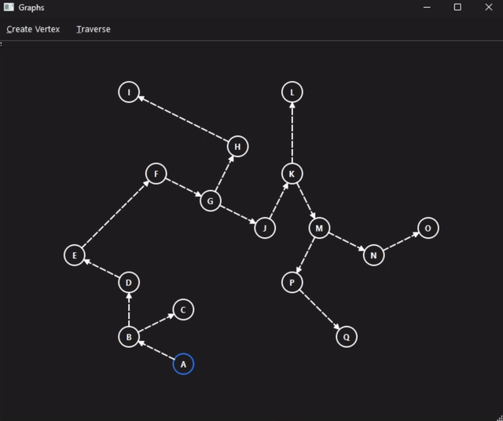

## Adjacency List/Matrix Graph ADT
A modular graph library written in C++ with adjacency list and adjacency matrix representation, traversal algorithms, and a driver—used to validate shortest-path and connectivity algorithms.

 
<table>
    <tr>
        <th>Vertex Creation</th>
        <th>Graph Traversal</th>
    </tr>
    <tr align="center">
        <td>
             
            Specify x and y position of new vertex to create and connect to.
        </td>
        <td >
             
            Demonstration of a depth-first traversal.
        </td>
    </tr>
</table> 

## Structure
<table>
    <tr>
        <th>Object</th>
        <th>Purpose</th>
        <th>Key Members</th>
        <th>Key Operations</th>
    </tr>
    <tr valign="top">
        <td>
            <strong>GraphVertex&lt;T&gt;</strong>
        </td>
        <td >
            Represents a graph vertex for an adjacency list implementation of the graph data structure.
        </td>
        <td>
            <code><strong>data</strong></code>: the data contained within the vertex 
            <code><strong>edges</strong></code>: a list of other GraphVertex objects, represents directed edges 
        </td>
        <td >
            <code><strong>connectTo</strong></code>: forms a directed edge to GraphVertex parameter by adding it to the edges list. 
            <code><strong>depthFirst</strong></code>: performs a recursive traversal on all directed edges, calls lambda function parameter for each visited vertex
        </td>
    </tr>
    <tr valign="top">
        <td>
            <strong>ListGraph&lt;T&gt;</strong>
        </td>
        <td >
            Represents an adjacency list implementation of the graph data structure.
        </td>
        <td >
            <code><strong>root</strong></code>: pointer to the root vertex of the graph 
            <code><strong>traversedStack</strong></code>: dynamic stack containing traversed GraphVertex objects in reverse order of last traversal, used to clear vertex traversal flags 
            <code><strong>traversedOrderStack</strong></code>: dynamic stack containing traversed GraphVertex objects in order of the last traversal, used for visiting vertices in traversal order only when desired
        </td>
        <td>
            <code><strong>add</strong></code>: creates a directed edge in the graph between two <strong>GraphVertex</strong> objects with data matching arguments 
            <code><strong>depthFirst</strong></code>: Performs a depth-first traversal on the graph from the root vertex, calls lambda function parameter for each visited <strong>GraphVertex</strong> 
            <code><strong>depthStep</strong></code>: Step through a depth-first traversal by visiting the top-most item from the <strong>traverseOrderStack</strong>
            <code><strong>untraverse</strong></code>: Pops traversed <strong>GraphVertex</strong> objects from <storng>traversedStack</storng>, calling lambda function parameter for each popped <strong>GraphVertex</strong>
        </td>
    </tr>
    <tr valign="top">
        <td>
            <strong>GUIVertex</strong>
        </td>
        <td >
            [...]
        </td>
        <td >
            [...]
        </td>
        <td >
            [...]
        </td>
    </tr>
    <tr valign="top">
        <td>
            <strong>GUIGraph</strong>
        </td>
        <td >
            [...]
        </td>
        <td >
            [...]
        </td>
        <td >
            [...]
        </td>
    </tr>
</table>