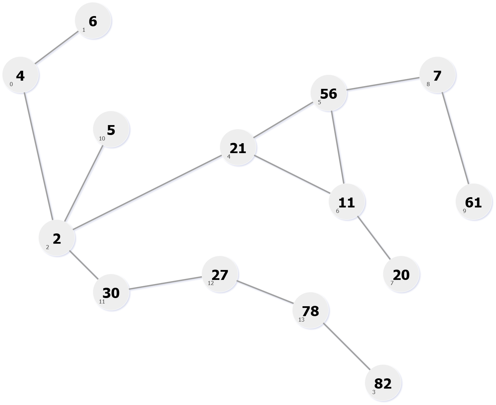

## Adjacency List/Matrix Graph ADT
A modular graph library written in C++ with adjacency list and adjacency matrix representation, traversal algorithms, and a driver—used to validate shortest-path and connectivity algorithms.

 

## Adjacency Matrix Representation
<table>
    <tr>
        <th>Before Removal</th>
        <th>After Removal</th>
    </tr>
    <tr align="center">
        <td>
             
            We will remove vertex with label '34' at index 3.
        </td>
        <td >
             
            Vertex with label '82' is now at index 3.
        </td>
    </tr>
</table>